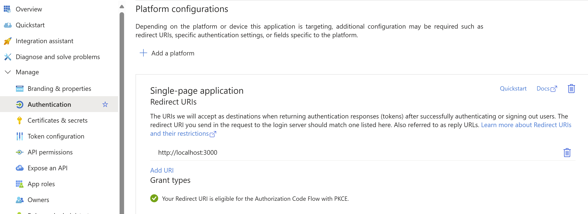
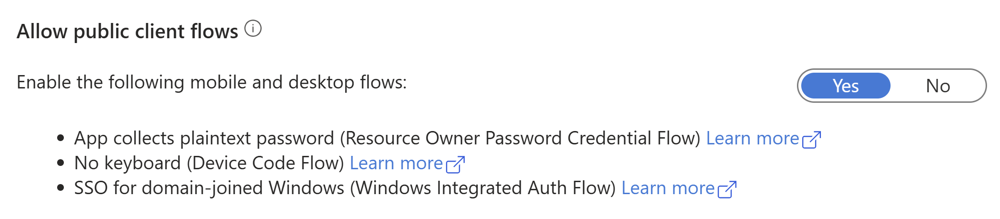
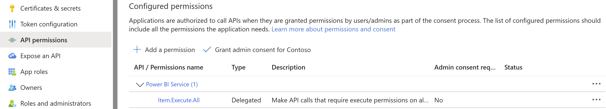
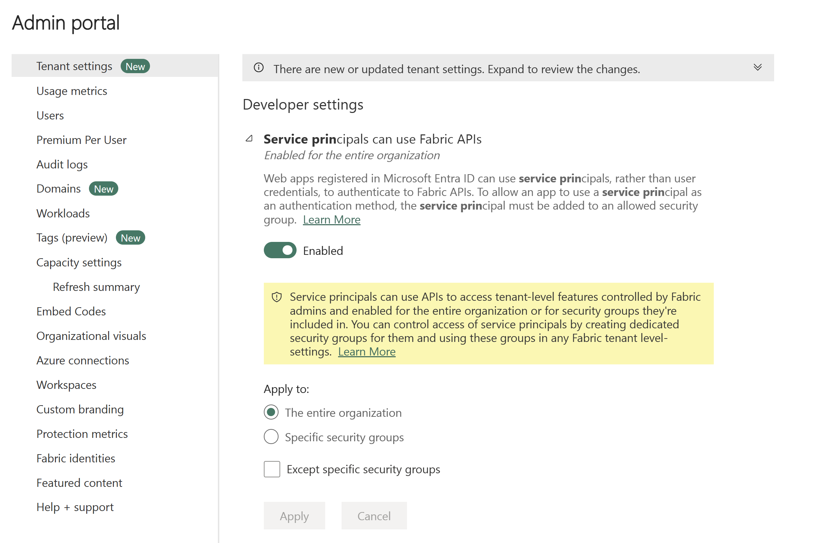
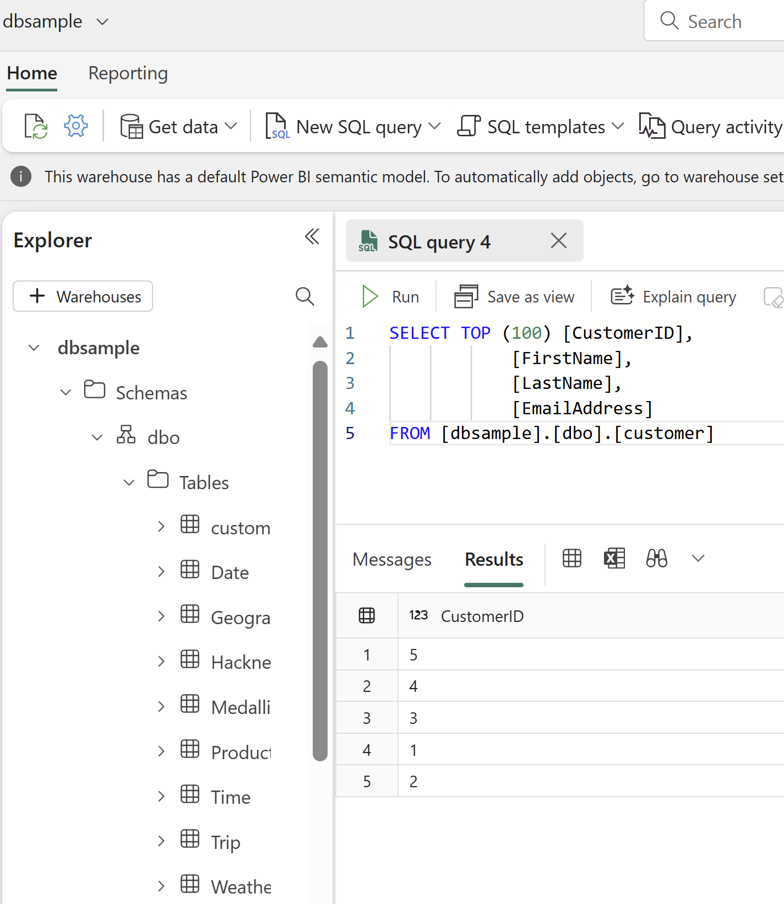
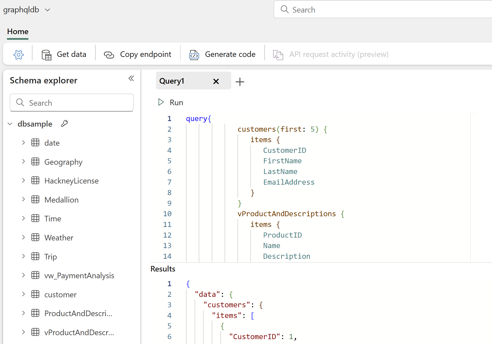
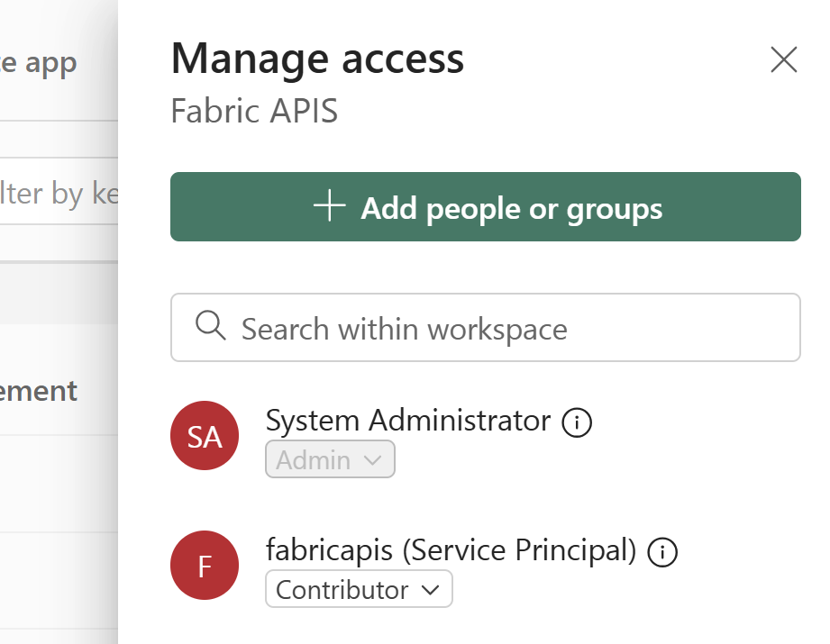
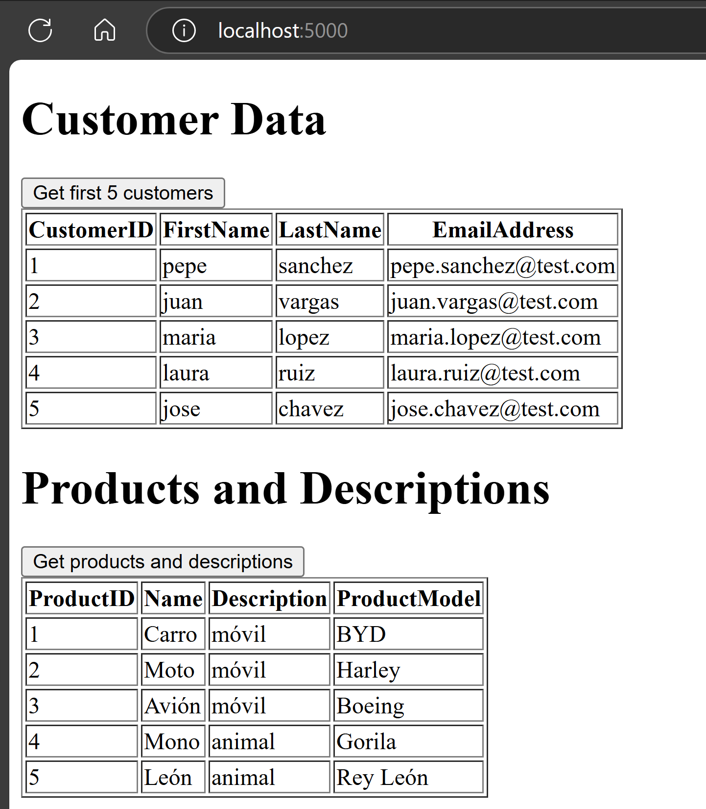
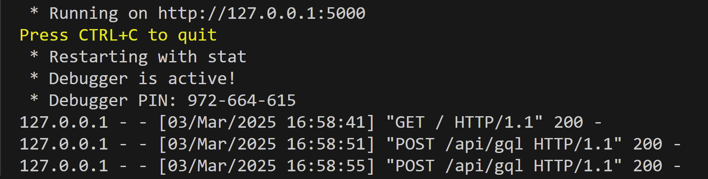

# fabric_graphql_sample

In Azure:

1) Create a Service Principal with the following configuration:

- In Certificates & Secrets: Create a secret
- In Authentication: 
    - Add platform (single page)
    
    - Allow public client flows
    
- In API Permissions
    - Add a permission - PowerBI Service delegate permissions, item.execute.all: 
    

Reference: https://learn.microsoft.com/en-us/fabric/data-engineering/connect-apps-api-graphql#create-a-microsoft-entra-app 

In Fabric:

0) Enable Service principals can use Fabric APIs

1) Create the sample Datawarehouse

2) Create the Fabric GrapQL service and add the datasource. Then validate the query.

3) Add Contributor role in the workspace where are both GraphQL and DWH

Note: The sample use SP, then the only method allow to access is SSO (stored credentials not currently supported).

Reference: https://learn.microsoft.com/en-us/fabric/data-engineering/get-started-api-graphql

To execute the python.app:
1) Define the virtual environment
2) Install flusk
3) python app.py

Web Results:

Terminal output:

References:
- https://blog.fabric.microsoft.com/en-US/blog/build-a-python-app-with-fabric-api-for-graphql/
- https://code.visualstudio.com/docs/python/environments#_creating-environments
- https://learn.microsoft.com/en-us/fabric/data-engineering/api-graphql-overview
